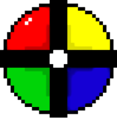

# Simons Says

Ett litet projekt som använder sig av React Hooks för att återskapa spelet "Simon Says".

Spelet skapades under en kortare session där vi gick igenom *mobb programmering* under en gemensam träff för studenter på utbildningen *WEBBUTVECKLARE .NET* på Yrkeshögskolan **Campus Värnamo**. Hackathonet ägde rum den 25 maj 2021.

### Kom igång och spela

Använd `npm install` för att installera alla behövda paket och `npm start` för att starta och öppna spelet i din webbläsare.

### Syftet
Syftet med hackathonet var att lära sig utveckla i stora samtida grupper (mobb programmering) och lära sig mer om att bygga webbapplikationer med React och framförallt React Hooks.

## Utvecklat i Mobb av WU20

- [Viktor Lyresten](https://github.com/lyret) (Lärare)
- [Daumantas Dani Indreika] (https://github.com/Justice3000)(Student) :rocket:
- [Alma Härlin](https://github.com/Haal20) (Student)
- [Wivianne Grapenholt](https://github.com/WiviWonderWoman)(student) :octocat:
- [Axel Svahn](https://github.com/axelsvahn) (Student)
- [Sven Kilberg] (Student)
- [Anthon Wellsjö](https://github.com/anthonwellsjo) (Student)
- [Nandan Tyagi](https://github.com/nandantyagi) (Student)